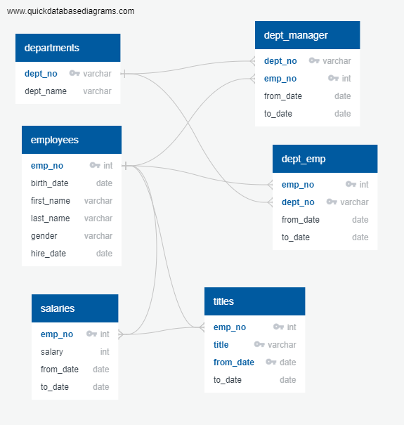
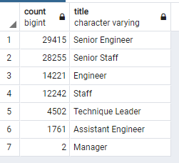
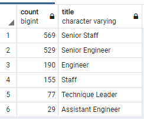

# Pewlett-Hackard-Analysis

## Overview of the analysis: Explain the purpose of this analysis.
In consideration of upcoming baby-boomer retirements, Pewlett-Hackard is evaluating this circumstance by:
- Offering retirement packages for those employees who meet certain criteria.
- Determining which roles need to be filled from the large number of vacancies created by these retirements.

The goal of this project is to assist Bobby, an HR Analyst in answering:
1. Who will be retiring in the next few years?
2. How many positions will Pewlett-Hackard need to fill?

Our analysis will generate a list of all employees who are eligible for the retirement package.  The analysis begins by examining 6, comma-delimited .csv files that Pewlett-Hackard maintains their records with:  
- departments.csv; a listing of 9 departments with their department number and department name.
- employees.csv; a listing of over 300,000 current and former employees
- dept_managers.csv; as listing of the historical record of managers by department
- dept_emp.csv; a listing of over 331,000 historical records of employee assignments by department
- salaries.csv; a 500,000 listing of historical records of employee salaries
- titles.csv; a 444,000 listing of historical employee titles

Pewlett-Hackard HR does not have any of these records stored in a database.

Our first steps with this project will be to create tables in a Postgres SQL database and then import data from these .csv files into the tables we create.  For this effort, we will start by creating an Entity Relationship Diagram (ERD).

Our ERD will be generated from open source software called Quick DBD.  Following is the ERD for our starting data:




## Results: 

Assumptions and actions we are building our analysis around are as follows:
1. We estimate the set of employees that will retire are those employees born between the beginning of 1952 and the end of 1955.  We will build a table of all employees born in the named time period.
2. Because our data is a full historical record, we will distill the list and report these employees by their most current title.
3. Next, we will create a report that indicates how many retirements are estimated by department.
4. To address filling vacancies we will create a second list of employees born in 1965.  This is the set of employees that we believe should be considered for mentorships.

### SQL Code Snipets
The SQL Query code to accomplish our first item above is as follows:
```
-- Challenge Deliverable 1
-- create a Retirement Titles table that holds all the titles of current employees who were born between January 1, 1952 and December 31, 1955.
SELECT e.emp_no, e.first_name, e.last_name, t.title, t.from_date, t.to_date
INTO retirement_titles
FROM employees AS e
LEFT JOIN titles AS t
	ON (e.emp_no = t.emp_no)
WHERE  birth_date BETWEEN '1952-01-01' AND '1955-12-31'
ORDER BY e.emp_no;
```
In this code, you can see that we are pulling data from two tables, the employees table and the titles table.  We join these with a Left Outer join.  Last we filter by the stated date span and put the records in order by employee number.  

This data set results in over 133,000 records.  However we are pulling duplicates because of the historical nature of the data.

To acccomplish the second item above, we use the following query to have a distinct list of individuals who will be retiring by title.  No duplicates and our count is 90,398.
```
-- Use Dictinct with Orderby to remove duplicate rows
SELECT DISTINCT ON (emp_no) emp_no,
first_name,
last_name,
title
INTO unique_titles
FROM retirement_titles
ORDER BY emp_no, from_date DESC;
```
Our third action is to report how many of these individuals are retiring in each department.  We used the following SQL code:
```
-- Count titles from unique_titles table
SELECT COUNT(title), title
INTO retiring_titles
FROM unique_titles
GROUP BY title
ORDER BY COUNT(title) DESC;
```

Following is the result of the retiring employee counts by department:



Our last bit of analysis involves creating the list of employees born in 1965 that we believe are eligible to particpate in the mentorship program.  Following is our code snipet:

```
-- CREATE Mentorship Eligibility Table
SELECT DISTINCT ON(e.emp_no) e.emp_no, e.first_name, e.last_name, e.birth_date, de.from_date, de.to_date, t.title
INTO mentorship_eligibility
FROM employees AS e
LEFT JOIN dept_emp AS de
	ON (e.emp_no = de.emp_no)
INNER JOIN titles AS t
	ON (e.emp_no = t.emp_no)
WHERE de.to_date = ('9999-01-01') AND e.birth_date BETWEEN '1965-01-01' AND '1965-12-31'
ORDER BY e.emp_no, t.from_date DESC;
```
There are 1,549 current employees who were born in 1965 and are eligible to be mentored.

## Summary: 

How many roles will need to be filled as the "silver tsunami" begins to make an impact?  This question was answered by our analysis.  The sum of unique retirements or the sum of retirements by department is 90,398.

Are there enough qualified, retirement-ready employees in the departments to mentor the next generation of Pewlett Hackard employees?  To look at this we'll see how the mentorship_eligible folks break down by department for the group selected.  See following table:


